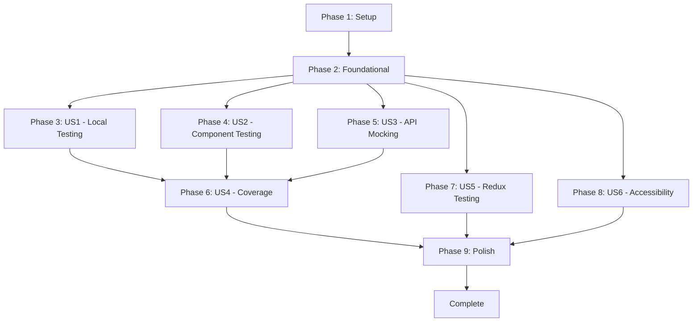

# Implementation Plan: Unit Testing Infrastructure

**Feature**: 001-unit-testing
**Status**: Ready for Phase-by-Phase Implementation
**Created**: 2025-01-17

## Overview

This document outlines the phase-by-phase implementation of the unit testing infrastructure for DistributorHub. Each phase will be executed sequentially, with user approval required before proceeding to the next phase.

## Checklist Status

| Checklist | Total | Completed | Incomplete | Status |
|-----------|-------|-----------|------------|--------|
| requirements.md | 15 | 15 | 0 | ✓ PASS |

**All checklists are complete. Proceeding with implementation.**

---

## Phase 1: Setup (Shared Infrastructure)

**Purpose**: Install dependencies and create project structure for testing

### Tasks (T001-T007)

| Task ID | Description | Status |
|---------|-------------|--------|
| T001 | Install Vitest and core testing dependencies: `npm install -D vitest @vitest/coverage-v8 jsdom` | Pending |
| T002 | Install React Testing Library packages: `npm install -D @testing-library/react@latest @testing-library/user-event@latest` | Pending |
| T003 [P] | Install MSW for API mocking: `npm install -D msw` | Pending |
| T004 [P] | Install vitest-axe for accessibility testing: `npm install -D vitest-axe` | Pending |
| T005 | Add test scripts to package.json | Pending |
| T006 | Create vitest.config.js with jsdom environment, globals, and coverage thresholds | Pending |
| T007 | Create vitest.setup.js with jest-dom matchers and cleanup | Pending |

### Deliverables

- All testing dependencies installed
- `package.json` updated with test scripts
- `vitest.config.js` created with proper configuration
- `vitest.setup.js` created with test setup

### Verification

- Running `npm test` should start Vitest (even with no tests yet)

---

## Phase 2: Foundational (Blocking Prerequisites)

**Purpose**: Core test utilities that ALL user stories depend on

### Tasks (T008-T016)

| Task ID | Description | Status |
|---------|-------------|--------|
| T008 | Create src/test-utils/ directory structure | Pending |
| T009 | Create custom render wrapper with Redux Provider and BrowserRouter in src/test-utils/render.jsx | Pending |
| T010 [P] | Create mock data factories for common entities in src/test-utils/mocks.js | Pending |
| T011 | Create src/__mocks__/ directory structure for MSW handlers | Pending |
| T012 | Create MSW server setup file in src/__mocks__/server.js | Pending |
| T013 | Create combined MSW handlers export in src/__mocks__/handlers.js | Pending |
| T014 | Update vitest.setup.js to import MSW server and add lifecycle hooks | Pending |
| T015 | Create .env.test file with test environment variables | Pending |
| T016 | Add coverage/ directory to .gitignore | Pending |

### Deliverables

- `src/test-utils/` directory with render wrapper and mocks
- `src/__mocks__/` directory with MSW server setup
- `.env.test` file with test environment variables
- `.gitignore` updated

### Verification

- `npm test` runs successfully with MSW initialized
- Custom render wrapper available

---

## Phase 3: User Story 1 - Developer Runs Tests Locally (Priority: P1)

**Goal**: Developers can run `npm test` and see pass/fail results within 30 seconds

### Tasks (T017-T021)

| Task ID | Description | Status |
|---------|-------------|--------|
| T017 [US1] | Create example component test for Button in src/components/ui/Button.test.jsx | Pending |
| T018 [US1] | Create example service test for validators in src/utils/validators.test.js | Pending |
| T019 [US1] | Verify `npm test` executes and displays results with pass/fail status | Pending |
| T020 [US1] | Verify `npm run test:watch` runs in watch mode and re-runs on file changes | Pending |
| T021 [US1] | Verify test failure messages show clear assertion details with file and line numbers | Pending |

### Deliverables

- Example component test for Button
- Example service test for validators
- Verified test execution workflows

### Verification

- Developers can run tests locally with `npm test`
- Watch mode works
- Error messages are clear

---

## Phase 4: User Story 2 - Component Testing with User Interactions (Priority: P1)

**Goal**: Developers can test React components with simulated clicks, inputs, and state changes

### Tasks (T022-T029)

| Task ID | Description | Status |
|---------|-------------|--------|
| T022 [P] [US2] | Create comprehensive Button test with click handlers in src/components/ui/Button.test.jsx | Pending |
| T023 [P] [US2] | Create Input component test with user typing simulation in src/components/ui/Input.test.jsx | Pending |
| T024 [P] [US2] | Create Checkbox component test with toggle interaction in src/components/ui/Checkbox.test.jsx | Pending |
| T025 [P] [US2] | Create Select component test with option selection in src/components/ui/Select.test.jsx | Pending |
| T026 [US2] | Create NavigationSidebar test with navigation clicks in src/components/navigation/NavigationSidebar.test.jsx | Pending |
| T027 [US2] | Create UserProfileDropdown test with dropdown interactions in src/components/navigation/UserProfileDropdown.test.jsx | Pending |
| T028 [US2] | Verify userEvent simulates realistic interactions | Pending |
| T029 [US2] | Configure snapshot testing and create example snapshot test | Pending |

### Deliverables

- Comprehensive component tests for UI components
- User interaction testing demonstrated
- Snapshot testing configured

### Verification

- Component tests demonstrate user interaction testing
- All UI components have basic interaction tests

---

## Phase 5: User Story 3 - API Service Mocking (Priority: P1)

**Goal**: Developers can mock API calls so tests run quickly without network dependencies

### Tasks (T030-T038)

| Task ID | Description | Status |
|---------|-------------|--------|
| T030 [P] [US3] | Create MSW handlers for auth endpoints in src/__mocks__/handlers/auth.js | Pending |
| T031 [P] [US3] | Create MSW handlers for deal endpoints in src/__mocks__/handlers/deals.js | Pending |
| T032 [P] [US3] | Create MSW handlers for partner endpoints in src/__mocks__/handlers/partners.js | Pending |
| T033 [US3] | Update src/__mocks__/handlers.js to combine all handler files | Pending |
| T034 [US3] | Create authService test with mocked login/logout in src/services/authService.test.js | Pending |
| T035 [US3] | Create dealService test with mocked CRUD operations in src/services/dealService.test.js | Pending |
| T036 [US3] | Create partnerService test with mocked API calls in src/services/partnerService.test.js | Pending |
| T037 [US3] | Demonstrate error response mocking (500, 404, network error) in service tests | Pending |
| T038 [US3] | Verify tests run without actual network calls | Pending |

### Deliverables

- MSW handlers for auth, deals, and partners
- Service tests with mocked API calls
- Error response mocking demonstrated

### Verification

- Service tests demonstrate API mocking with MSW
- Success and error scenarios covered

---

## Phase 6: User Story 4 - Test Coverage Reporting (Priority: P2)

**Goal**: Developers can see coverage reports with line-by-line highlighting

### Tasks (T039-T045)

| Task ID | Description | Status |
|---------|-------------|--------|
| T039 [US4] | Configure coverage thresholds in vitest.config.js | Pending |
| T040 [US4] | Configure coverage reporters: text, html, json in vitest.config.js | Pending |
| T041 [US4] | Configure coverage include/exclude patterns to target src/ and exclude test files | Pending |
| T042 [US4] | Verify `npm run test:coverage` generates terminal summary | Pending |
| T043 [US4] | Verify coverage/index.html is generated with interactive report | Pending |
| T044 [US4] | Verify coverage failure when threshold not met | Pending |
| T045 [US4] | Add coverage badge configuration for CI integration (optional) | Pending |

### Deliverables

- Coverage thresholds configured
- Coverage reports generated (text, html, json)
- Coverage verification complete

### Verification

- Coverage reports work
- Thresholds enforced
- HTML report accessible

---

## Phase 7: User Story 5 - Redux State Testing (Priority: P2)

**Goal**: Developers can test Redux slices, selectors, and async thunks

### Tasks (T046-T051)

| Task ID | Description | Status |
|---------|-------------|--------|
| T046 [US5] | Update src/test-utils/render.jsx to accept preloadedState for Redux testing | Pending |
| T047 [US5] | Create example reducer test demonstrating action dispatch and state assertion | Pending |
| T048 [US5] | Create example selector test demonstrating derived state verification | Pending |
| T049 [US5] | Create example async thunk test with MSW mocking pending/fulfilled/rejected states | Pending |
| T050 [US5] | Create AuthContext test with auth state management in src/contexts/AuthContext.test.jsx | Pending |
| T051 [US5] | Verify store isolation between tests (no state pollution) | Pending |

### Deliverables

- Redux testing patterns documented with working examples
- State management fully testable
- Store isolation verified

### Verification

- Redux testing patterns work
- State management fully testable

---

## Phase 8: User Story 6 - Accessibility Testing (Priority: P3)

**Goal**: Developers can run automated accessibility checks to catch WCAG violations

### Tasks (T052-T057)

| Task ID | Description | Status |
|---------|-------------|--------|
| T052 [US6] | Add vitest-axe matchers to vitest.setup.js | Pending |
| T053 [US6] | Create Button accessibility test with axe checks in src/components/ui/Button.test.jsx | Pending |
| T054 [US6] | Create Input accessibility test verifying labels and ARIA in src/components/ui/Input.test.jsx | Pending |
| T055 [US6] | Create form component accessibility test for focus management | Pending |
| T056 [US6] | Verify axe violations provide remediation guidance in test output | Pending |
| T057 [US6] | Document accessibility testing pattern in quickstart.md examples | Pending |

### Deliverables

- Accessibility tests demonstrate axe integration
- Violations reported with guidance
- Accessibility testing pattern documented

### Verification

- Accessibility tests demonstrate axe integration
- Violations reported with guidance

---

## Phase 9: Polish & Cross-Cutting Concerns

**Purpose**: Complete remaining component/service tests and documentation

### Remaining Component Tests (T058-T063)

| Task ID | Description | Status |
|---------|-------------|--------|
| T058 [P] | Create AppIcon test in src/components/AppIcon.test.jsx | Pending |
| T059 [P] | Create AppImage test in src/components/AppImage.test.jsx | Pending |
| T060 [P] | Create CookieConsent test in src/components/CookieConsent.test.jsx | Pending |
| T061 [P] | Create BreadcrumbNavigation test in src/components/navigation/BreadcrumbNavigation.test.jsx | Pending |
| T062 [P] | Create NotificationCenter test in src/components/navigation/NotificationCenter.test.jsx | Pending |
| T063 [P] | Create QuickActionToolbar test in src/components/navigation/QuickActionToolbar.test.jsx | Pending |

### Remaining Service Tests (T064-T069)

| Task ID | Description | Status |
|---------|-------------|--------|
| T064 [P] | Create auditService test in src/services/auditService.test.js | Pending |
| T065 [P] | Create complianceService test in src/services/complianceService.test.js | Pending |
| T066 [P] | Create emailService test in src/services/emailService.test.js | Pending |
| T067 [P] | Create productService test in src/services/productService.test.js | Pending |
| T068 [P] | Create quoteService test in src/services/quoteService.test.js | Pending |
| T069 [P] | Create registrationService test in src/services/registrationService.test.js | Pending |

### Utility Tests (T070)

| Task ID | Description | Status |
|---------|-------------|--------|
| T070 [P] | Create cn utility test in src/utils/cn.test.js | Pending |

### Integration Tests (T071-T073)

| Task ID | Description | Status |
|---------|-------------|--------|
| T071 | Create src/__tests__/integration/ directory | Pending |
| T072 | Create authentication integration test in src/__tests__/integration/authentication.test.jsx | Pending |
| T073 | Create deal management integration test in src/__tests__/integration/dealManagement.test.jsx | Pending |

### Documentation & Cleanup (T074-T077)

| Task ID | Description | Status |
|---------|-------------|--------|
| T074 | Verify all example tests in quickstart.md work correctly | Pending |
| T075 | Run full test suite and verify all tests pass | Pending |
| T076 | Run coverage report and verify thresholds met | Pending |
| T077 | Final code cleanup and formatting | Pending |

### Verification

- All tests passing
- Coverage thresholds met
- Documentation accurate

---

## Implementation Flow

---

## Dependencies

### Phase Dependencies

- **Setup (Phase 1)**: No dependencies - can start immediately
- **Foundational (Phase 2)**: Depends on Setup completion - BLOCKS all user stories
- **User Stories (Phase 3-8)**: All depend on Foundational phase completion
- **Polish (Phase 9)**: Depends on all user stories being complete

### User Story Dependencies

- **User Story 1 (P1)**: Can start after Foundational - No dependencies on other stories
- **User Story 2 (P1)**: Can start after Foundational - No dependencies on other stories
- **User Story 3 (P1)**: Can start after Foundational - No dependencies on other stories
- **User Story 4 (P2)**: Can start after Foundational - Requires some tests to exist for meaningful coverage
- **User Story 5 (P2)**: Can start after Foundational - No dependencies on other stories
- **User Story 6 (P3)**: Can start after Foundational - No dependencies on other stories

---

## Approval Process

For each phase:
1. Execute all tasks in the phase
2. Verify checkpoint criteria
3. Update task status in tasks.md (mark completed tasks as [X])
4. Present phase completion summary to user
5. Request approval to proceed to next phase

---

## Current Status

**Ready to begin Phase 1: Setup (Shared Infrastructure)**

**Approval Required**: Do you want to proceed with Phase 1?
